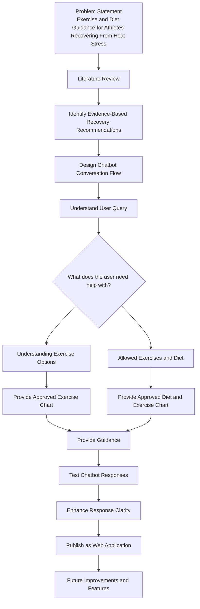

# Heat-Recovery-Chatbot

A chatbot prototype designed to provide evidence-based exercise and diet guidance for athletes recovering from heat stress.

---

## Project Objective

The goal of this project is to develop a chatbot capable of identifying user query and directing users(athlethes) toward appropriate exercise and dietary guidance during recovery from heat stress.

---

## Project Roadmap

---

## Current Status

- [ ] Project concept developed
- [ ] Repository created
- [ ] Roadmap designed
- [ ] Literature review
- [ ] Chatbot design
- [ ] Prototype development
- [ ] Prep web application

---

## To do 

- Interactive web application
