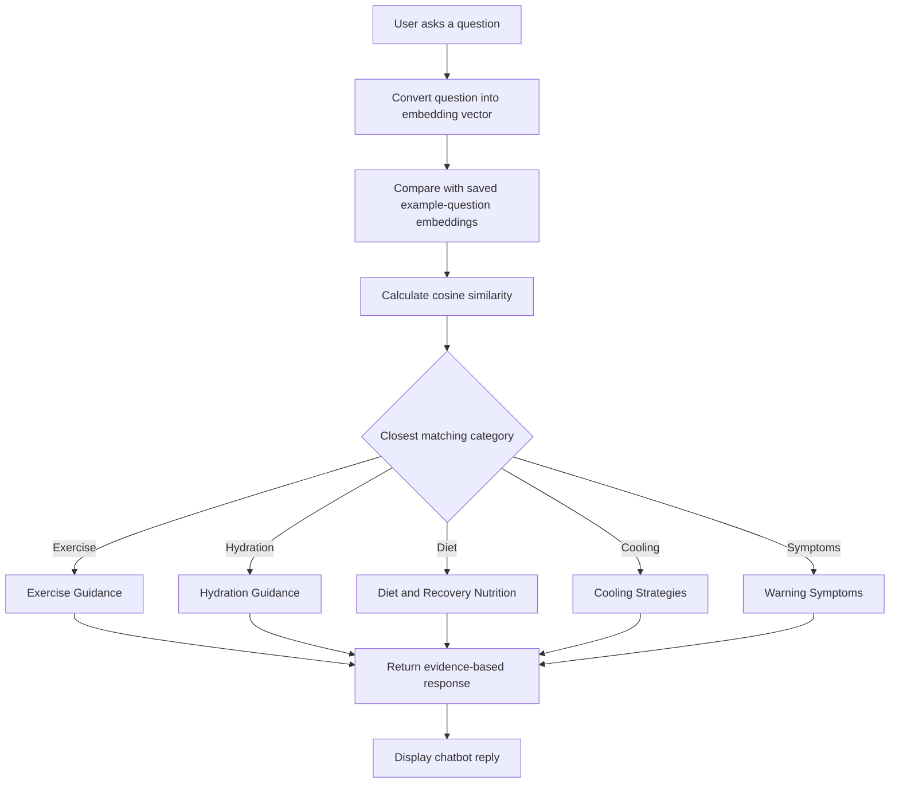

# Model Approach

## Overview

The chatbot is designed to provide evidence-based exercise, hydration, nutrition, and recovery guidance for athletes recovering from heat stress.

## Workflow Diagram

## Categories

- Exercise Guidance
- Hydration Guidance
- Diet and Recovery Nutrition
- Cooling Strategies
- Warning Symptoms

## Embedding Model

The chatbot uses a lightweight embedding model to convert user questions into vector representations.

## Similarity Matching

Cosine similarity is used to compare user questions against stored example-question embeddings.

## Response Strategy

Responses are retrieved from evidence extracted from peer-reviewed literature and professional guidelines rather than unrestricted text generation.
