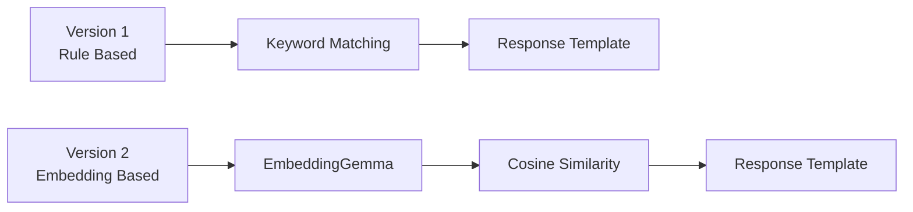

# Version Comparison  1 and Version 2 

```mermaid
flowchart LR

A[Version 1<br>Rule Based] --> B[Keyword Matching]
B --> C[Response Template]

D[Version 2<br>Embedding Based] --> E[EmbeddingGemma]
E --> F[Cosine Similarity]
F --> G[Response Template]
```
